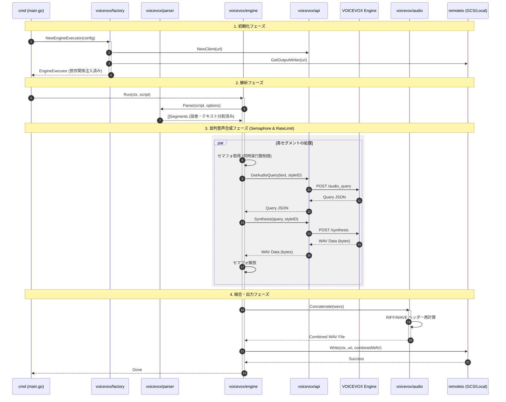

# ✍️ Go VOICEVOX

[](https://golang.org/)
[](https://golang.org/)
[](https://github.com/shouni/go-voicevox/tags)
[](https://opensource.org/licenses/MIT)

## 🚀 概要 (About) - 多彩な「声」を、Go で自在に操る。

Go VOICEVOX は、**VOICEVOX エンジン**の API を直感的かつ効率的に操作するための Go 言語製クライアントライブラリです。

複雑な音声合成のパラメータ調整、複数話者のスタイル管理、そして WAV データの結合処理までをひとつのパッケージに凝縮。
`httpkit` ベースの堅牢な通信基盤により、デスクトップアプリからバックエンドのバッチ処理まで、あらゆる Go プロジェクトに「命を吹き込む声」を簡単に組み込めます。

---

## ✨ 提供機能 (Features)

* **直感的なエンジン操作**: 煩雑な API エンドポイントの呼び出しを隠蔽し、`Synthesize` メソッドひとつで音声生成を完結させます。
* **高度な話者・スタイル解決 (`package speaker`)**: スタイル ID や話者名を型安全に管理。動的な話者データのロードと検索をサポートします。
* **ストリーミング & バッチ処理**: 大量のテキストをセグメント化して並列生成し、効率的に音声化するパイプラインを提供。
* **WAV オーディオ結合 (`package audio`)**: 複数の音声断片を、ヘッダー情報を維持したままシームレスに結合するロジックを内蔵。
* **柔軟なインプット解析 (`package parser`)**: 長文スクリプトを適切な長さで分割し、エンジンへの負荷を最適化します。
* **プラグイン可能な通信層**: 内部で `go-http-kit` を採用しており、リトライ処理やセキュリティ検証が標準で組み込まれています。

---

## 🚀 プロジェクトの処理概要

本ツールは、入力されたスクリプトを解析し、VOICEVOXエンジンと連携して並列で音声合成を行い、単一のWAVファイルとして出力するプロセスを自動化します。

1.  **起動と設定の読み込み** (`cmd`): `main.go` が起動し、CLIコマンド構造を実行します。
2.  **VOICEVOX Executorの初期化** (`voicevox/factory.go`): VOICEVOX API URLの決定、`api.Client` の初期化、`speaker.DataFinder` のロード、**および `remoteio.OutputWriter` の取得**を統括し、実行に必要な依存関係（`engine.EngineExecutor`）を組み立てます。
3.  **スクリプト解析** (`voicevox/parser`): 入力スクリプトを話者タグ（例：`[ずんだもん]`）に基づいて複数のセグメントに分割します。（**文字数による自動分割ロジックを含む**）
4.  **音声合成処理** (`voicevox/engine`):
    * **Functional Options** を適用し、フォールバックタグなどの設定を決定した後、セグメントごとに並列処理を開始します。
    * **堅牢性向上** 並列処理に際し、**セマフォ**による**同時実行数の制限**に加え、**時間ベースのレートリミッター**を導入しました。これにより、VOICEVOXエンジンへの過負荷を防ぎ、処理の安定性とエラー耐性を向上させています。また、API待機中に親コンテキストがキャンセルされた場合、Goroutineは即座に終了します。
    * `api.Client` を利用し、テキストとスタイルIDを元に `/audio_query` を呼び出し、音声クエリJSONを取得します。
    * 取得したクエリJSONとスタイルIDを元に `/synthesis` を呼び出し、個々のWAVデータ（バイトスライス）を取得します。
5.  **WAV結合** (`voicevox/audio`): 並列処理で取得されたすべてのWAVデータを結合し、ヘッダー情報（ファイルサイズ、データサイズ）を再計算して、単一の有効なWAVファイルを構築します。
6.  **ファイル出力** (`voicevox/engine`): 最終的な結合済みWAVファイルを、注入された`remoteio.OutputWriter` を利用して出力します。これにより、出力先がローカルファイルだけでなく、**Google Cloud Storage (GCS) などのリモートストレージ**にも対応可能となりました。

---

## 🔄 処理シーケンス図



---

## 🌳 プロジェクト構成ツリー図

```text
go-voicevox/
└── voicevox/            # VOICEVOX クライアントライブラリ本体
    ├── api/             # API 通信とデータモデル
    │   ├── client.go    # VOICEVOX API クライアント (httpkit 依存)
    │   ├── error.go     # API 通信、応答、JSON 解析のカスタムエラー
    │   └── model.go     # API 応答のデータモデル
    ├── audio/           # WAV データ処理ロジック
    │   ├── audio.go     # WAV データの結合とヘッダー処理
    │   └── const.go     # WAV 構造に関する定数
    ├── parser/          # スクリプト解析ロジック
    │   ├── const.go     # 解析に関する定数
    │   └── parser.go    # スクリプトのセグメント化ロジック
    ├── speaker/         # 話者データとスタイル ID の管理
    │   ├── const.go     # サポート対象話者、スタイルタグの静的定義
    │   ├── error.go     # ロード時のカスタムエラー
    │   ├── loader.go    # /speakers エンドポイントからのデータロード
    │   └── model.go     # SpeakerData (DataFinder 実装) 等の構造体
    ├── engine.go        # コア処理エンジン、バッチ処理、Functional Options 定義
    ├── factory.go       # Executor の初期化と依存関係の構築
    └── model.go         # EngineExecutor, EngineConfig 等のコア定義
```

## 🔩 外部依存ライブラリ (I/O抽象化)

本プロジェクトは、出力処理の柔軟性を高めるため、外部のI/O抽象化ライブラリに依存しています。

| ライブラリ名 | 役割 | GitHubリンク |
| :--- | :--- | :--- |
| `go-remote-io` | GCSおよびローカルファイルシステムへの統一的なI/O操作（`remoteio.OutputWriter`）を提供します。 | [https://github.com/shouni/go-remote-io](https://github.com/shouni/go-remote-io) |

---

## 📜 ライセンス (License)

* デフォルトキャラクター: VOICEVOX:ずんだもん、VOICEVOX:四国めたん
* このプロジェクトは [MIT License](https://opensource.org/licenses/MIT) の下で公開されています。
