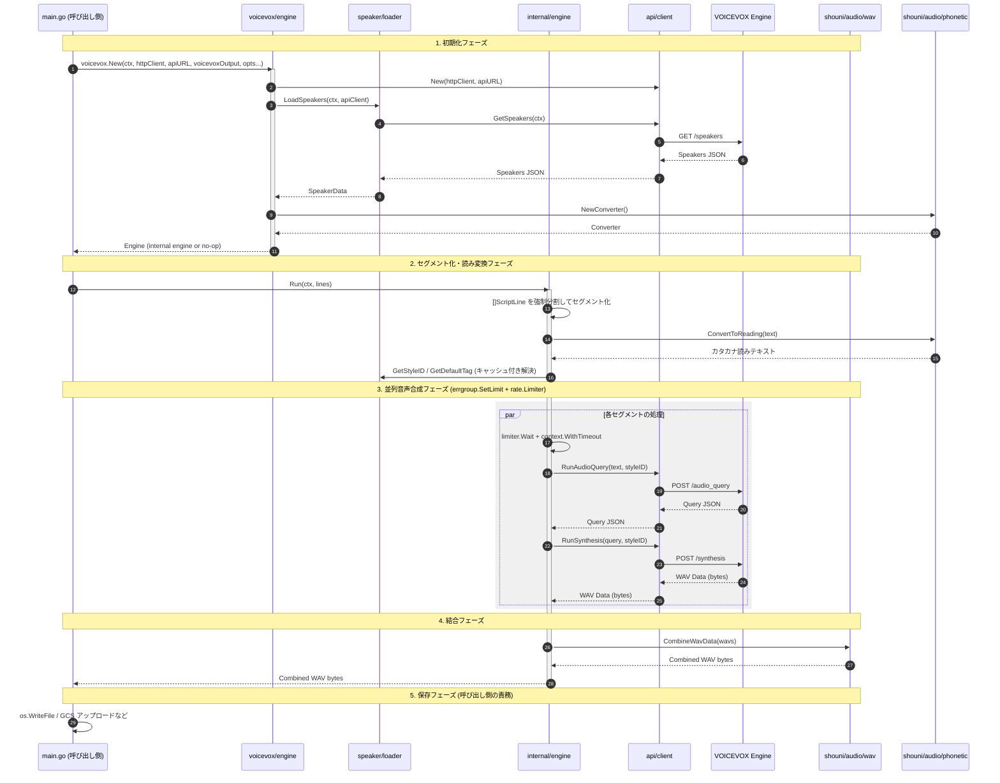

# ✍️ Go VOICEVOX

[](https://golang.org/)
[](https://golang.org/)
[](https://github.com/shouni/go-voicevox/tags)
[](https://opensource.org/licenses/MIT)
[](https://pkg.go.dev/github.com/shouni/go-voicevox)
[](#)

## 🚀 概要 (About) - 構造化スクリプトを、Go で音声に変換する。

Go VOICEVOX は、**VOICEVOX エンジン**の API を使って構造化スクリプトから音声を生成する Go 実装です。

`voicevox` による依存関係の組み立て、内部 engine による並列合成実行、`api` の WAV 結合までを分離しています。
本ライブラリの責務は **`[]ScriptLine` を受け取り、結合済みの WAV バイト列を返す** ことのみです。出力先
（ローカルファイル、GCS など）への保存は呼び出し側の責務です。

---

## ✨ 提供機能 (Features)

* **依存関係の組み立て (`package voicevox`)**: `voicevox.New(...)` が API クライアント初期化、話者データロード、内部 engine の生成を一括で実行します。`voicevoxOutput=false` 時は no-op 実装を返します。
* **話者・スタイル解決 (`package speaker`)**: `/speakers` の応答から `StyleIDMap` / `DefaultStyleMap` を構築し、`[話者][スタイル]` からスタイル ID を解決します。`SupportedSpeakerNames()` / `SupportedStyleNames()` で対応語彙を公開しており、AI へのレスポンススキーマ構築などに利用できます。
* **構造化スクリプト入力 (`Engine.Run`)**: `[]voicevox.ScriptLine`（`Speaker`/`Style`/`Direction`/`Text`）を受け取り、音声合成を実行します。AI の出力を JSON など構造化データとして受け取るデータ駆動な呼び出し側向けの入口です。
* **読み変換 (`github.com/shouni/audio/phonetic`)**: VOICEVOX が誤読しやすい漢字を避けるため、各セグメントのテキストを合成前にカタカナ読みへ変換します。呼び出し側で無効化はできない既定の挙動です。
* **並列合成制御 (`package internal/engine`)**: `errgroup.SetLimit` による同時実行制限、`rate.Limiter` によるレート制限、`context.WithTimeout` によるセグメント単位タイムアウトを適用します。
* **WAV 結合 (`github.com/shouni/audio/wav`)**: `wav.CombineWavData` で複数 WAV の `fmt/data` チャンクを検証しつつ結合し、ヘッダーサイズを再計算して出力します。
* **出力は呼び出し側の責務**: `Engine.Run` は結合済みの `[]byte` を返すだけで、ファイル書き込みや GCS アップロードなどの I/O は一切行いません。本ライブラリ自体はクラウドストレージにもローカルファイルシステムにも依存しません。

---

## 🧭 公開入口と内部実装

* ライブラリ利用時の入口は `package voicevox` です。通常は `voicevox.New(...)` と `Engine.Run(ctx, lines)` だけを使います。
* `main.go` はアプリ本体ではなく、このリポジトリ内でのデモ兼サンプル CLI です。返ってきた `[]byte` を自分でローカルファイルに書き込む例を示しています。
* 並列合成、セグメント分割、エラー集約の実体は `internal/engine` にあります。

## 🚀 プロジェクトの処理概要

本ツールは、入力された構造化スクリプトを VOICEVOX エンジンと連携して並列で音声合成し、単一の WAV バイト列
として返すプロセスを自動化します。保存や配信は呼び出し側が行います。

1.  **Engine 構築** (`voicevox/engine.go`): `voicevox.New(...)` が API URL を受け取り、`api.Client` 作成、`speaker.LoadSpeakers` 実行、`github.com/shouni/audio/phonetic.NewConverter()` による読み変換コンバータの構築、内部 engine の生成を行います。
2.  **セグメント化・読み変換・ID 解決** (`internal/engine/prepare.go`): `Run(...)` は `[]ScriptLine` の各行を `[話者][スタイル]` タグへ変換し、200 文字上限で強制分割した上で各チャンクをカタカナ読みへ変換し、`resolveStyleIDs` により各セグメントのスタイル ID をキャッシュ付きで解決します。
3.  **並列音声合成** (`internal/engine/synthesis.go`): `errgroup.SetLimit` + `rate.Limiter` + `context.WithTimeout` を使い、`/audio_query` と `/synthesis` を各セグメント単位で実行します。
4.  **WAV 結合** (`internal/engine/output.go`): 成功したセグメントの WAV を `github.com/shouni/audio/wav` の `CombineWavData(...)` で結合し、`[]byte` として返します。
5.  **保存** (呼び出し側): `Engine.Run` の戻り値をもとに、呼び出し側が任意の方法（ローカルファイル、GCS アップロードなど）で保存します。

---

## 🔄 処理シーケンス図


---

## 🌳 プロジェクト構成ツリー図
```text
go-voicevox/
├── main.go              # デモ/サンプル CLI（初期化・実行・保存の例）
├── api/                 # VOICEVOX API 通信
├── voicevox/            # 公開 API と Engine の組み立て
├── internal/engine/     # セグメント化・並列合成・WAV結合・エラー集約
└── speaker/             # 話者/スタイルデータのロードと検索
```

---

## 📜 ライセンス (License)

* デフォルトキャラクター: VOICEVOX:ずんだもん、VOICEVOX:四国めたん
* このプロジェクトは [MIT License](https://opensource.org/licenses/MIT) の下で公開されています。
