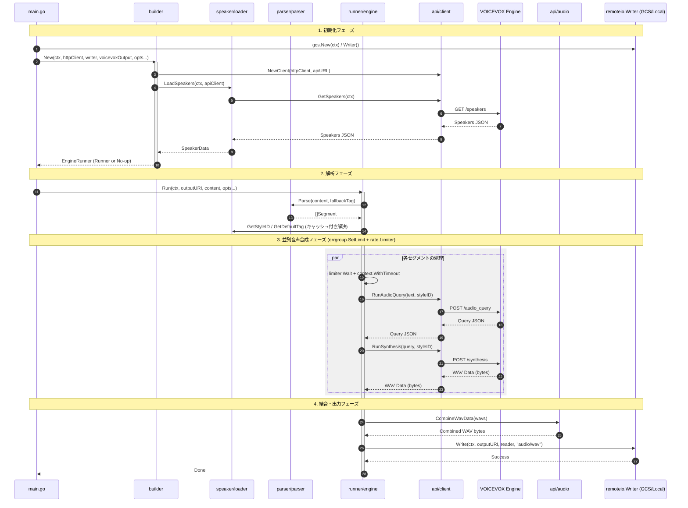

# ✍️ Go VOICEVOX

[](https://golang.org/)
[](https://golang.org/)
[](https://github.com/shouni/go-voicevox/tags)
[](https://opensource.org/licenses/MIT)

## 🚀 概要 (About) - 多彩な「声」を、Go で自在に操る。

Go VOICEVOX は、**VOICEVOX エンジン**の API を使ってスクリプトから音声を生成する Go 実装です。

`builder` による依存関係の組み立て、`runner` による並列合成実行、`parser` によるタグ付きスクリプト分割、`api` の WAV 結合までを分離し、ローカル/GCS への出力まで一貫して扱えます。

---

## ✨ 提供機能 (Features)

* **依存関係の組み立て (`package builder`)**: `builder.New(...)` が API クライアント初期化、話者データロード、`runner.Engine` の生成を一括で実行します。`voicevoxOutput=false` 時は no-op 実装を返します。
* **話者・スタイル解決 (`package speaker`)**: `/speakers` の応答から `StyleIDMap` / `DefaultStyleMap` を構築し、`[話者][スタイル]` からスタイル ID を解決します。
* **柔軟なスクリプト解析 (`package parser`)**: タグ付き行の解析、タグなし行の補完、句読点優先の分割、200 文字上限による強制分割に対応します。
* **並列合成制御 (`package runner`)**: `errgroup.SetLimit` による同時実行制限、`rate.Limiter` によるレート制限、`context.WithTimeout` によるセグメント単位タイムアウトを適用します。
* **WAV 結合 (`package api`)**: `api.CombineWavData` で複数 WAV の `fmt/data` チャンクを検証しつつ結合し、ヘッダーサイズを再計算して出力します。
* **出力先の抽象化 (`go-remote-io`)**: `remoteio.Writer` を通してローカルファイルと GCS URI の両方に書き込み可能です。

---

## 🚀 プロジェクトの処理概要

本ツールは、入力されたスクリプトを解析し、VOICEVOXエンジンと連携して並列で音声合成を行い、単一のWAVファイルとして出力するプロセスを自動化します。

1.  **起動と I/O 初期化** (`main.go`): `gcs.New(ctx)` から `remoteio.Writer` を取得し、HTTP クライアントと実行オプションを構成します。
2.  **Runner 構築** (`builder/engine.go`): `builder.New(...)` が `VOICEVOX_API_URL` を解決し、`api.Client` 作成、`speaker.LoadSpeakers` 実行、`runner.NewEngine` 呼び出しを行います。
3.  **スクリプト解析と ID 解決** (`runner/engine.go`, `parser/parser.go`): `Run(...)` 開始後、`Parse(content, fallbackTag)` でセグメント化し、各セグメントのスタイル ID をキャッシュ付きで解決します。
4.  **並列音声合成** (`runner/engine.go`): `errgroup.SetLimit` + `rate.Limiter` + `context.WithTimeout` を使い、`/audio_query` と `/synthesis` を各セグメント単位で実行します。
5.  **WAV 結合** (`api/audio.go`): 成功したセグメントの WAV を `api.CombineWavData(...)` で結合します。
6.  **出力書き込み** (`runner/engine.go`): `remoteio.Writer.Write(...)` で `outputURI` に `audio/wav` として保存します。

---

## 🔄 処理シーケンス図


---

## 🌳 プロジェクト構成ツリー図
```text
go-voicevox/
├── main.go              # エントリポイント（初期化と実行）
├── api/                 # VOICEVOX API 通信と WAV 結合
├── builder/             # EngineRunner の依存関係組み立て
├── parser/              # タグ付きスクリプト解析と分割
├── ports/               # インターフェースとオプション定義
├── runner/              # 並列合成・エラー集約・出力処理
└── speaker/             # 話者/スタイルデータのロードと検索
```

## 🔩 外部依存ライブラリ (I/O抽象化)

本プロジェクトは、出力処理の柔軟性を高めるため、外部のI/O抽象化ライブラリに依存しています。

| ライブラリ名 | 役割 | GitHubリンク |
| :--- | :--- | :--- |
| `go-remote-io` | GCSおよびローカルファイルシステムへの統一的なI/O操作（`remoteio.Writer`）を提供します。 | [https://github.com/shouni/go-remote-io](https://github.com/shouni/go-remote-io) |

---

## 📜 ライセンス (License)

* デフォルトキャラクター: VOICEVOX:ずんだもん、VOICEVOX:四国めたん
* このプロジェクトは [MIT License](https://opensource.org/licenses/MIT) の下で公開されています。
