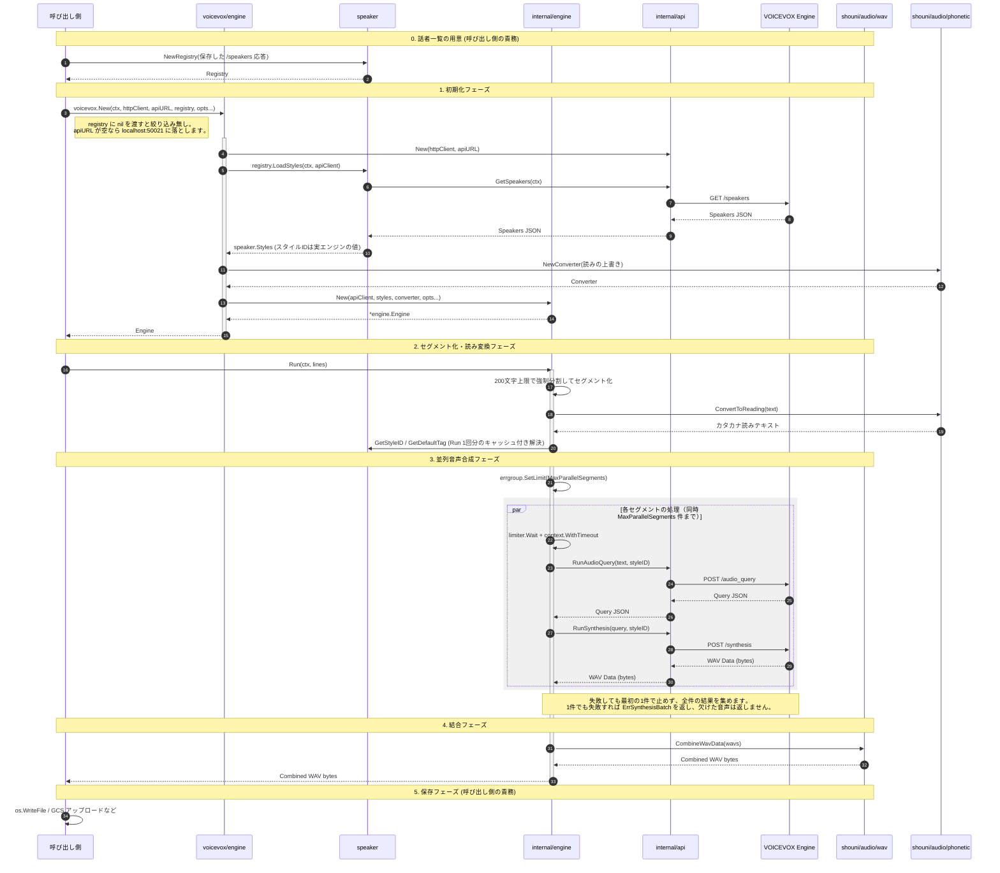

# ✍️ Go VOICEVOX

[](https://golang.org/)
[](https://golang.org/)
[](https://github.com/shouni/go-voicevox/tags)
[](https://opensource.org/licenses/MIT)
[](https://pkg.go.dev/github.com/shouni/go-voicevox)
[](#)

## 🚀 概要 (About)

Go VOICEVOX は、**VOICEVOX エンジン**の API を使って構造化スクリプトから音声を生成する Go ライブラリです。

責務は **`[]ScriptLine` を受け取り、結合済みの WAV バイト列を返す** ことだけです。ファイル書き込みも
クラウドストレージへのアップロードも行わず、それらに依存もしません。保存は呼び出し側が決めます。

```go
engine, err := voicevox.New(ctx, httpClient, apiURL, registry)
wavBytes, err := engine.Run(ctx, []voicevox.ScriptLine{
    {Speaker: "四国めたん", Style: "ノーマル", Text: "こんにちは。"},
})
os.WriteFile("out.wav", wavBytes, 0o644) // 保存は呼び出し側の責務
```

---

## ✨ 提供機能 (Features)

* **組み立ては1関数** — `voicevox.New(...)` が API クライアント・話者データ・読み変換器・内部 engine を
  まとめて用意します。
* **話者一覧は持ちません** — 誰を使うかはアプリケーションの方針なので、保存した `/speakers` 応答を
  `speaker.NewRegistry(raw)` に渡します（`nil` ならエンジンが提供する話者をすべて受け入れ）。
  **スタイル ID は常に実物のエンジンから取ります** — エンジンのビルドで変わるため、保存した ID を
  使うと更新の遅れが「別のキャラの声で喋る」形で出ます。
* **語彙の公開** — `Registry` の `SpeakerNames()` / `StyleNames()` / `StylesFor(name)` /
  `DefaultStyleFor(name)`。AI のレスポンススキーマ構築などに使えます。**話者ごとに引ける `StylesFor`
  を推奨** します。`StyleNames()` は和集合なので、実在しない組み合わせを AI に選ばせてしまいます
  （選ばれた分は既定スタイルへ落ち、指示が黙って無視されます）。
* **読み変換は必須** — VOICEVOX が誤読しやすい漢字を避けるため、合成前に必ずカタカナ読みへ変換します。
  呼び出し側で無効化はできません。
* **数字の読み** — `WithNumberReading()` で算用数字を日本語の読みへ変換します。
  **既定では有効ではありません。** 形態素解析器の辞書は算用数字に読みを持たないため、
  既定だと "2026年8月" が "2026ネン8ツキ" になり、VOICEVOX が字面どおりに読みます
  （8日→ハチニチ、1人→イチニン、20歳→ニジュッサイ）。付けると数の読みと助数詞の音の変化
  （一回→イッカイ、三本→サンボン）まで当てます。**変換結果を見ても数字のままなので、
  無効のままだと合成するまで誤読に気づけません。** 日付・人数・年齢が出る台本では付けてください。
* **読みの上書き** — `WithReadingOverrides(map[string]string{"8日": "ヨウカ"})` で、表記ごとの読みを
  追加できます。**固有名詞と、規則で当たらない読みのためのものです** — 数字と助数詞は
  `WithNumberReading` が規則で読むので、そちらが先です。
  どの語をどう読ませるかはアプリケーションの語彙なので、話者一覧と同じくライブラリは中身を持ちません。
* **並列合成の制御** — 同時実行数・レート・セグメント単位のタイムアウトを
  `WithMaxParallelSegments` / `WithSegmentRateLimit` / `WithSegmentTimeout` で調整できます
  （既定は 5 並列 / 100ms 間隔 / 180 秒。既定のままでよければ渡さないでください）。
  投入間隔はスループットのつまみではなく、起動時の一斉接続をならすためのものです。
  **出力順は入力順を保ちます**。
* **エラーは集約** — 最初の失敗で止めず、全セグメントの失敗をまとめて1つのエラーで返します。
* **Engine は構築後に不変** — 1つの `Engine` を複数のゴルーチンから同時に `Run` できます。

---

## 🔄 処理シーケンス図



---

## 🌳 プロジェクト構成

利用時の入口は `package voicevox` だけです。通常は `voicevox.New(...)` と `Engine.Run(ctx, lines)`
しか使いません。

```text
go-voicevox/
├── main.go        # デモ/サンプル CLI。ライブラリ本体ではありません
├── voicevox/      # 公開 API。New が依存を組み立て、Engine を返す
├── speaker/       # /speakers 応答の構造・Registry・スタイルIDの解決 (Registry.LoadStyles)
└── internal/      # 外から使わないもの
    ├── api/       #   VOICEVOX API 通信（/audio_query・/synthesis・/speakers）
    └── engine/    #   セグメント化・読み変換・並列合成・WAV 結合・失敗の集約
```

---

## 📜 ライセンス (License)

* 使用するキャラクターは呼び出し側が `speaker.Registry` で決めます。このライブラリ自体は特定の
  キャラクターを同梱・指定しません。合成した音声を公開する際は、VOICEVOX 本体および各音声ライブラリの
  利用規約に従ってください（クレジット表記が必要です）。
* このプロジェクトは [MIT License](https://opensource.org/licenses/MIT) の下で公開されています。
