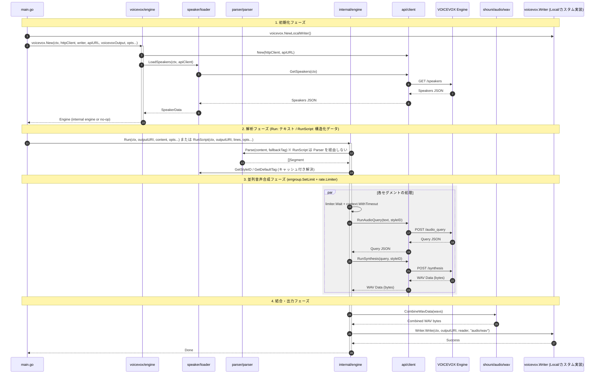

# ✍️ Go VOICEVOX

[](https://golang.org/)
[](https://golang.org/)
[](https://github.com/shouni/go-voicevox/tags)
[](https://opensource.org/licenses/MIT)
[](https://goreportcard.com/report/github.com/shouni/go-voicevox)
[](https://pkg.go.dev/github.com/shouni/go-voicevox)
[](#)

## 🚀 概要 (About) - 多彩な「声」を、Go で自在に操る。

Go VOICEVOX は、**VOICEVOX エンジン**の API を使ってスクリプトから音声を生成する Go 実装です。

`voicevox` による依存関係の組み立て、内部 engine による並列合成実行、`parser` によるタグ付きスクリプト分割、`api` の WAV 結合までを分離し、ローカル/GCS への出力まで一貫して扱えます。

---

## ✨ 提供機能 (Features)

* **依存関係の組み立て (`package voicevox`)**: `voicevox.New(...)` が API クライアント初期化、話者データロード、内部 engine の生成を一括で実行します。`voicevoxOutput=false` 時は no-op 実装を返します。
* **話者・スタイル解決 (`package speaker`)**: `/speakers` の応答から `StyleIDMap` / `DefaultStyleMap` を構築し、`[話者][スタイル]` からスタイル ID を解決します。
* **柔軟なスクリプト解析 (`package parser`)**: タグ付き行の解析、タグなし行の補完、句読点優先の分割、200 文字上限による強制分割に対応します。
* **構造化スクリプト入力 (`Engine.RunScript`)**: `[]voicevox.ScriptLine`（`Speaker`/`Style`/`Direction`/`Text`）を直接受け取り、テキストパーサーを経由せずに音声合成できます。AI の出力を JSON など構造化データとして受け取るデータ駆動な呼び出し側向けの入口です。
* **並列合成制御 (`package internal/engine`)**: `errgroup.SetLimit` による同時実行制限、`rate.Limiter` によるレート制限、`context.WithTimeout` によるセグメント単位タイムアウトを適用します。
* **WAV 結合 (`github.com/shouni/audio/wav`)**: `wav.CombineWavData` で複数 WAV の `fmt/data` チャンクを検証しつつ結合し、ヘッダーサイズを再計算して出力します。
* **出力先の抽象化 (`voicevox.Writer`)**: 最小インターフェースの `Writer` を介して出力します。標準で `voicevox.NewLocalWriter()`（ローカルファイルシステム）を提供し、GCS 等が必要な場合は呼び出し側で `Writer` を実装します。本ライブラリ自体はクラウドストレージに依存しません。

---

## 🧭 公開入口と内部実装

* ライブラリ利用時の入口は `package voicevox` です。通常は `voicevox.New(...)` と `Engine.Run(...)`（テキスト）または `Engine.RunScript(...)`（構造化データ）だけを使います。
* `main.go` はアプリ本体ではなく、このリポジトリ内でのデモ兼サンプル CLI です。
* 並列合成、出力、エラー集約の実体は `internal/engine` にあります。
* `Run(..., voicevox.WithFallbackTag(...))` に渡す値は、`[話者][スタイル]` の完全なタグである必要があります。`"[ノーマル]"` のようなスタイル単体は無効です。`RunScript` は各 `ScriptLine` が話者・スタイルを明示するため `WithFallbackTag` を使いません。
* 出力先は `voicevox.Writer` インターフェースで抽象化されています。ローカルファイルには `voicevox.NewLocalWriter()` を、それ以外（GCS 等）が必要な場合は呼び出し側で `Writer` を実装して `voicevox.New(...)` に渡してください。

## 🚀 プロジェクトの処理概要

本ツールは、入力されたスクリプトを解析し、VOICEVOXエンジンと連携して並列で音声合成を行い、単一のWAVファイルとして出力するプロセスを自動化します。

1.  **起動と I/O 初期化** (`main.go`): デモ CLI が `voicevox.NewLocalWriter()` で出力先 `Writer` を用意し、HTTP クライアント、`VOICEVOX_API_URL`、実行オプションを構成します。
2.  **Engine 構築** (`voicevox/engine.go`): `voicevox.New(...)` が API URL を受け取り、`api.Client` 作成、`speaker.LoadSpeakers` 実行、内部 engine の生成を行います。
3.  **スクリプト解析と ID 解決** (`internal/engine/prepare.go`): `Run(...)` は `Parse(content, fallbackTag)` で、`RunScript(...)` は `[]ScriptLine` から直接セグメント化し、いずれも共通の `resolveStyleIDs` で各セグメントのスタイル ID をキャッシュ付きで解決します。
4.  **並列音声合成** (`internal/engine/synthesis.go`): `errgroup.SetLimit` + `rate.Limiter` + `context.WithTimeout` を使い、`/audio_query` と `/synthesis` を各セグメント単位で実行します。
5.  **WAV 結合** (`internal/engine/output.go`): 成功したセグメントの WAV を `github.com/shouni/audio/wav` の `CombineWavData(...)` で結合します。
6.  **出力書き込み** (`internal/engine/output.go`): 呼び出し側から注入された `Writer.Write(...)` で `outputURI` に `audio/wav` として保存します。

---

## 🔄 処理シーケンス図


---

## 🌳 プロジェクト構成ツリー図
```text
go-voicevox/
├── main.go              # デモ/サンプル CLI（初期化と実行例）
├── api/                 # VOICEVOX API 通信と WAV 結合
├── voicevox/            # 公開 API と Engine の組み立て
├── parser/              # タグ付きスクリプト解析と分割
├── internal/engine/     # 並列合成・エラー集約・出力処理
└── speaker/             # 話者/スタイルデータのロードと検索
```

## 🔩 出力先の抽象化

本ライブラリはクラウドストレージ等の外部 I/O ライブラリに依存しません。出力は最小インターフェースの
`voicevox.Writer`（`Write(ctx, path, io.Reader, ...WriteOption) error`）を介して行われ、標準では
`voicevox.NewLocalWriter()` によるローカルファイルシステム出力を提供します。GCS などが必要な場合は、
呼び出し側で `Writer` を実装して `voicevox.New(...)` に渡してください。

---

## 📜 ライセンス (License)

* デフォルトキャラクター: VOICEVOX:ずんだもん、VOICEVOX:四国めたん
* このプロジェクトは [MIT License](https://opensource.org/licenses/MIT) の下で公開されています。
